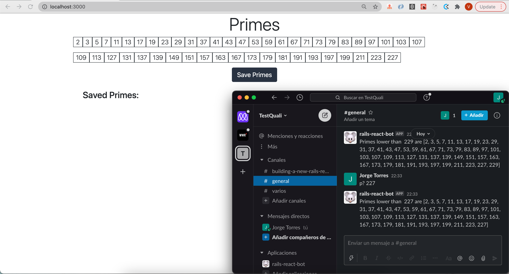

Rails-React-SlackBot
==================

### Description:

It is a Slackbot that performs simple math operations (+,-,*,/) and also checks if a number is prime putting 'p?' before the number to check, if the number is prime the bot will display all the prime numbers smaller than the given number and at the same time it will display the array of numbers in the browser through a React app.

## Screenshot



## Built With

- Ruby v2.7.2
- Ruby on Rails v6.0.3.4
- Slackbot API
- Bootstrap
- React
- VSCode

### Prerequisites

- Ruby: 2.7.2
- Rails: 6.0.3.4
- Postgres: >=9.5
- Slack

### Instructions:

In Slack administration create a new Bot Integration under [services/new/bot](http://slack.com/services/new/bot). On the next screen note the Slack API token.


```
1. - Run `git clone https://github.com/Yors-git/rails_react_slack.git` to copy to your computer
2. - CD into folder and run `bundle install` to install Ruby Gems
3. - Run `rails db:create` to create a local database
4. - Run `rails db:migrate` to migrate the database
5. - Run `SLACK_API_TOKEN="your token here" rails s`
6. - Invite the bot to a channel and ask for a prime number or do a math operation
7. - Open `http://localhost:3000/` in your browser to start the React app and it should show the resulting array if you enter a prime number in slack
8. - You can save the prime array to the database with the Save button

```

## Author:

### 👨‍💻 Jorge Torres

- Github: [Jorge Torres](https://github.com/Yors-git)
- Linkedin: [Jorge Torres](https://www.linkedin.com/in/jtbribiesca/)
- Twitter: [@Yors_82](https://twitter.com/Yors_82)


### Copyright & License

Created by Jorge Torres.